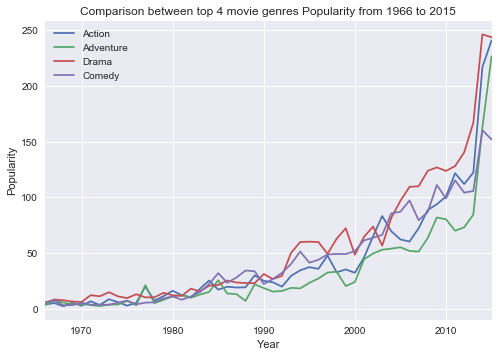
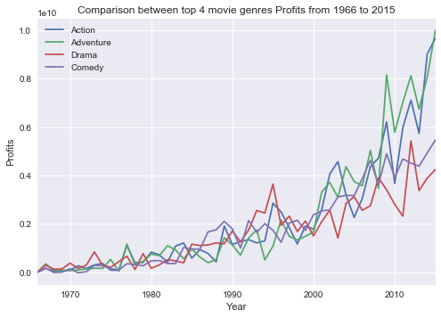
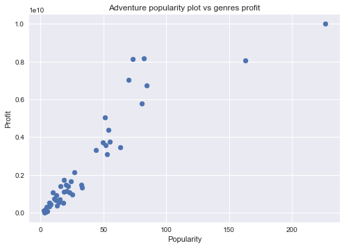
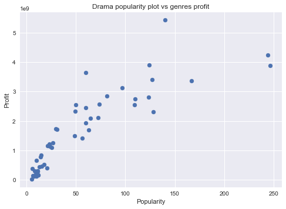
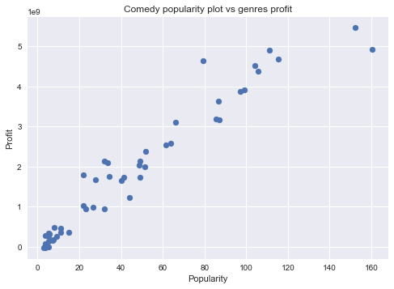

# Project: Investigate TMDB Dataset 

## Table of Contents
<ul>
<li><a href="#intro">Introduction</a></li>
<li><a href="#wrangling">Data Wrangling</a></li>
<li><a href="#eda">Exploratory Data Analysis</a></li>
<li><a href="#conclusions">Conclusions</a></li>
</ul>

<a id='intro'></a>
## Introduction

This is an analysis on the TMDB dataset. The TMDB dataset contains 10866 movies with the specifications of the movie.

This analysis will be focusing on:

1. Top 4 genres of movie from 1966 to 2016
2. Does profit has a connection with a genres popularity.


```python
#importing all packages needed for this analysis
import unicodecsv, pandas as pd, numpy as np, matplotlib.pyplot as plt, seaborn


```

<a id='wrangling'></a>
## Data Wrangling


### General Properties


```python
# Load your data and print out a few lines. Perform operations to inspect data
#   types and look for instances of missing or possibly errant data.
movie_df = pd.read_csv("tmdb-movies.csv")
movie_df
```


<div>
<style>
    .dataframe thead tr:only-child th {
        text-align: right;
    }

    .dataframe thead th {
        text-align: left;
    }

    .dataframe tbody tr th {
        vertical-align: top;
    }
</style>
<table border="1" class="dataframe">
  <thead>
    <tr style="text-align: right;">
      <th></th>
      <th>id</th>
      <th>imdb_id</th>
      <th>popularity</th>
      <th>budget</th>
      <th>revenue</th>
      <th>original_title</th>
      <th>cast</th>
      <th>homepage</th>
      <th>director</th>
      <th>tagline</th>
      <th>...</th>
      <th>overview</th>
      <th>runtime</th>
      <th>genres</th>
      <th>production_companies</th>
      <th>release_date</th>
      <th>vote_count</th>
      <th>vote_average</th>
      <th>release_year</th>
      <th>budget_adj</th>
      <th>revenue_adj</th>
    </tr>
  </thead>
  <tbody>
    <tr>
      <th>0</th>
      <td>135397</td>
      <td>tt0369610</td>
      <td>32.985763</td>
      <td>150000000</td>
      <td>1513528810</td>
      <td>Jurassic World</td>
      <td>Chris Pratt|Bryce Dallas Howard|Irrfan Khan|Vi...</td>
      <td>http://www.jurassicworld.com/</td>
      <td>Colin Trevorrow</td>
      <td>The park is open.</td>
      <td>...</td>
      <td>Twenty-two years after the events of Jurassic ...</td>
      <td>124</td>
      <td>Action|Adventure|Science Fiction|Thriller</td>
      <td>Universal Studios|Amblin Entertainment|Legenda...</td>
      <td>6/9/15</td>
      <td>5562</td>
      <td>6.5</td>
      <td>2015</td>
      <td>1.379999e+08</td>
      <td>1.392446e+09</td>
    </tr>
    <tr>
      <th>1</th>
      <td>76341</td>
      <td>tt1392190</td>
      <td>28.419936</td>
      <td>150000000</td>
      <td>378436354</td>
      <td>Mad Max: Fury Road</td>
      <td>Tom Hardy|Charlize Theron|Hugh Keays-Byrne|Nic...</td>
      <td>http://www.madmaxmovie.com/</td>
      <td>George Miller</td>
      <td>What a Lovely Day.</td>
      <td>...</td>
      <td>An apocalyptic story set in the furthest reach...</td>
      <td>120</td>
      <td>Action|Adventure|Science Fiction|Thriller</td>
      <td>Village Roadshow Pictures|Kennedy Miller Produ...</td>
      <td>5/13/15</td>
      <td>6185</td>
      <td>7.1</td>
      <td>2015</td>
      <td>1.379999e+08</td>
      <td>3.481613e+08</td>
    </tr>
    <tr>
      <th>2</th>
      <td>262500</td>
      <td>tt2908446</td>
      <td>13.112507</td>
      <td>110000000</td>
      <td>295238201</td>
      <td>Insurgent</td>
      <td>Shailene Woodley|Theo James|Kate Winslet|Ansel...</td>
      <td>http://www.thedivergentseries.movie/#insurgent</td>
      <td>Robert Schwentke</td>
      <td>One Choice Can Destroy You</td>
      <td>...</td>
      <td>Beatrice Prior must confront her inner demons ...</td>
      <td>119</td>
      <td>Adventure|Science Fiction|Thriller</td>
      <td>Summit Entertainment|Mandeville Films|Red Wago...</td>
      <td>3/18/15</td>
      <td>2480</td>
      <td>6.3</td>
      <td>2015</td>
      <td>1.012000e+08</td>
      <td>2.716190e+08</td>
    </tr>
    <tr>
      <th>3</th>
      <td>140607</td>
      <td>tt2488496</td>
      <td>11.173104</td>
      <td>200000000</td>
      <td>2068178225</td>
      <td>Star Wars: The Force Awakens</td>
      <td>Harrison Ford|Mark Hamill|Carrie Fisher|Adam D...</td>
      <td>http://www.starwars.com/films/star-wars-episod...</td>
      <td>J.J. Abrams</td>
      <td>Every generation has a story.</td>
      <td>...</td>
      <td>Thirty years after defeating the Galactic Empi...</td>
      <td>136</td>
      <td>Action|Adventure|Science Fiction|Fantasy</td>
      <td>Lucasfilm|Truenorth Productions|Bad Robot</td>
      <td>12/15/15</td>
      <td>5292</td>
      <td>7.5</td>
      <td>2015</td>
      <td>1.839999e+08</td>
      <td>1.902723e+09</td>
    </tr>
    <tr>
      <th>4</th>
      <td>168259</td>
      <td>tt2820852</td>
      <td>9.335014</td>
      <td>190000000</td>
      <td>1506249360</td>
      <td>Furious 7</td>
      <td>Vin Diesel|Paul Walker|Jason Statham|Michelle ...</td>
      <td>http://www.furious7.com/</td>
      <td>James Wan</td>
      <td>Vengeance Hits Home</td>
      <td>...</td>
      <td>Deckard Shaw seeks revenge against Dominic Tor...</td>
      <td>137</td>
      <td>Action|Crime|Thriller</td>
      <td>Universal Pictures|Original Film|Media Rights ...</td>
      <td>4/1/15</td>
      <td>2947</td>
      <td>7.3</td>
      <td>2015</td>
      <td>1.747999e+08</td>
      <td>1.385749e+09</td>
    </tr>
    <tr>
      <th>5</th>
      <td>281957</td>
      <td>tt1663202</td>
      <td>9.110700</td>
      <td>135000000</td>
      <td>532950503</td>
      <td>The Revenant</td>
      <td>Leonardo DiCaprio|Tom Hardy|Will Poulter|Domhn...</td>
      <td>http://www.foxmovies.com/movies/the-revenant</td>
      <td>Alejandro González Iñárritu</td>
      <td>(n. One who has returned, as if from the dead.)</td>
      <td>...</td>
      <td>In the 1820s, a frontiersman, Hugh Glass, sets...</td>
      <td>156</td>
      <td>Western|Drama|Adventure|Thriller</td>
      <td>Regency Enterprises|Appian Way|CatchPlay|Anony...</td>
      <td>12/25/15</td>
      <td>3929</td>
      <td>7.2</td>
      <td>2015</td>
      <td>1.241999e+08</td>
      <td>4.903142e+08</td>
    </tr>
    <tr>
      <th>6</th>
      <td>87101</td>
      <td>tt1340138</td>
      <td>8.654359</td>
      <td>155000000</td>
      <td>440603537</td>
      <td>Terminator Genisys</td>
      <td>Arnold Schwarzenegger|Jason Clarke|Emilia Clar...</td>
      <td>http://www.terminatormovie.com/</td>
      <td>Alan Taylor</td>
      <td>Reset the future</td>
      <td>...</td>
      <td>The year is 2029. John Connor, leader of the r...</td>
      <td>125</td>
      <td>Science Fiction|Action|Thriller|Adventure</td>
      <td>Paramount Pictures|Skydance Productions</td>
      <td>6/23/15</td>
      <td>2598</td>
      <td>5.8</td>
      <td>2015</td>
      <td>1.425999e+08</td>
      <td>4.053551e+08</td>
    </tr>
    <tr>
      <th>7</th>
      <td>286217</td>
      <td>tt3659388</td>
      <td>7.667400</td>
      <td>108000000</td>
      <td>595380321</td>
      <td>The Martian</td>
      <td>Matt Damon|Jessica Chastain|Kristen Wiig|Jeff ...</td>
      <td>http://www.foxmovies.com/movies/the-martian</td>
      <td>Ridley Scott</td>
      <td>Bring Him Home</td>
      <td>...</td>
      <td>During a manned mission to Mars, Astronaut Mar...</td>
      <td>141</td>
      <td>Drama|Adventure|Science Fiction</td>
      <td>Twentieth Century Fox Film Corporation|Scott F...</td>
      <td>9/30/15</td>
      <td>4572</td>
      <td>7.6</td>
      <td>2015</td>
      <td>9.935996e+07</td>
      <td>5.477497e+08</td>
    </tr>
    <tr>
      <th>8</th>
      <td>211672</td>
      <td>tt2293640</td>
      <td>7.404165</td>
      <td>74000000</td>
      <td>1156730962</td>
      <td>Minions</td>
      <td>Sandra Bullock|Jon Hamm|Michael Keaton|Allison...</td>
      <td>http://www.minionsmovie.com/</td>
      <td>Kyle Balda|Pierre Coffin</td>
      <td>Before Gru, they had a history of bad bosses</td>
      <td>...</td>
      <td>Minions Stuart, Kevin and Bob are recruited by...</td>
      <td>91</td>
      <td>Family|Animation|Adventure|Comedy</td>
      <td>Universal Pictures|Illumination Entertainment</td>
      <td>6/17/15</td>
      <td>2893</td>
      <td>6.5</td>
      <td>2015</td>
      <td>6.807997e+07</td>
      <td>1.064192e+09</td>
    </tr>
    <tr>
      <th>9</th>
      <td>150540</td>
      <td>tt2096673</td>
      <td>6.326804</td>
      <td>175000000</td>
      <td>853708609</td>
      <td>Inside Out</td>
      <td>Amy Poehler|Phyllis Smith|Richard Kind|Bill Ha...</td>
      <td>http://movies.disney.com/inside-out</td>
      <td>Pete Docter</td>
      <td>Meet the little voices inside your head.</td>
      <td>...</td>
      <td>Growing up can be a bumpy road, and it's no ex...</td>
      <td>94</td>
      <td>Comedy|Animation|Family</td>
      <td>Walt Disney Pictures|Pixar Animation Studios|W...</td>
      <td>6/9/15</td>
      <td>3935</td>
      <td>8.0</td>
      <td>2015</td>
      <td>1.609999e+08</td>
      <td>7.854116e+08</td>
    </tr>
    <tr>
      <th>10</th>
      <td>206647</td>
      <td>tt2379713</td>
      <td>6.200282</td>
      <td>245000000</td>
      <td>880674609</td>
      <td>Spectre</td>
      <td>Daniel Craig|Christoph Waltz|Léa Seydoux|Ralp...</td>
      <td>http://www.sonypictures.com/movies/spectre/</td>
      <td>Sam Mendes</td>
      <td>A Plan No One Escapes</td>
      <td>...</td>
      <td>A cryptic message from Bond’s past sends him...</td>
      <td>148</td>
      <td>Action|Adventure|Crime</td>
      <td>Columbia Pictures|Danjaq|B24</td>
      <td>10/26/15</td>
      <td>3254</td>
      <td>6.2</td>
      <td>2015</td>
      <td>2.253999e+08</td>
      <td>8.102203e+08</td>
    </tr>
    <tr>
      <th>11</th>
      <td>76757</td>
      <td>tt1617661</td>
      <td>6.189369</td>
      <td>176000003</td>
      <td>183987723</td>
      <td>Jupiter Ascending</td>
      <td>Mila Kunis|Channing Tatum|Sean Bean|Eddie Redm...</td>
      <td>http://www.jupiterascending.com</td>
      <td>Lana Wachowski|Lilly Wachowski</td>
      <td>Expand your universe.</td>
      <td>...</td>
      <td>In a universe where human genetic material is ...</td>
      <td>124</td>
      <td>Science Fiction|Fantasy|Action|Adventure</td>
      <td>Village Roadshow Pictures|Dune Entertainment|A...</td>
      <td>2/4/15</td>
      <td>1937</td>
      <td>5.2</td>
      <td>2015</td>
      <td>1.619199e+08</td>
      <td>1.692686e+08</td>
    </tr>
    <tr>
      <th>12</th>
      <td>264660</td>
      <td>tt0470752</td>
      <td>6.118847</td>
      <td>15000000</td>
      <td>36869414</td>
      <td>Ex Machina</td>
      <td>Domhnall Gleeson|Alicia Vikander|Oscar Isaac|S...</td>
      <td>http://exmachina-movie.com/</td>
      <td>Alex Garland</td>
      <td>There is nothing more human than the will to s...</td>
      <td>...</td>
      <td>Caleb, a 26 year old coder at the world's larg...</td>
      <td>108</td>
      <td>Drama|Science Fiction</td>
      <td>DNA Films|Universal Pictures International (UP...</td>
      <td>1/21/15</td>
      <td>2854</td>
      <td>7.6</td>
      <td>2015</td>
      <td>1.379999e+07</td>
      <td>3.391985e+07</td>
    </tr>
    <tr>
      <th>13</th>
      <td>257344</td>
      <td>tt2120120</td>
      <td>5.984995</td>
      <td>88000000</td>
      <td>243637091</td>
      <td>Pixels</td>
      <td>Adam Sandler|Michelle Monaghan|Peter Dinklage|...</td>
      <td>http://www.pixels-movie.com/</td>
      <td>Chris Columbus</td>
      <td>Game On.</td>
      <td>...</td>
      <td>Video game experts are recruited by the milita...</td>
      <td>105</td>
      <td>Action|Comedy|Science Fiction</td>
      <td>Columbia Pictures|Happy Madison Productions</td>
      <td>7/16/15</td>
      <td>1575</td>
      <td>5.8</td>
      <td>2015</td>
      <td>8.095996e+07</td>
      <td>2.241460e+08</td>
    </tr>
    <tr>
      <th>14</th>
      <td>99861</td>
      <td>tt2395427</td>
      <td>5.944927</td>
      <td>280000000</td>
      <td>1405035767</td>
      <td>Avengers: Age of Ultron</td>
      <td>Robert Downey Jr.|Chris Hemsworth|Mark Ruffalo...</td>
      <td>http://marvel.com/movies/movie/193/avengers_ag...</td>
      <td>Joss Whedon</td>
      <td>A New Age Has Come.</td>
      <td>...</td>
      <td>When Tony Stark tries to jumpstart a dormant p...</td>
      <td>141</td>
      <td>Action|Adventure|Science Fiction</td>
      <td>Marvel Studios|Prime Focus|Revolution Sun Studios</td>
      <td>4/22/15</td>
      <td>4304</td>
      <td>7.4</td>
      <td>2015</td>
      <td>2.575999e+08</td>
      <td>1.292632e+09</td>
    </tr>
    <tr>
      <th>15</th>
      <td>273248</td>
      <td>tt3460252</td>
      <td>5.898400</td>
      <td>44000000</td>
      <td>155760117</td>
      <td>The Hateful Eight</td>
      <td>Samuel L. Jackson|Kurt Russell|Jennifer Jason ...</td>
      <td>http://thehatefuleight.com/</td>
      <td>Quentin Tarantino</td>
      <td>No one comes up here without a damn good reason.</td>
      <td>...</td>
      <td>Bounty hunters seek shelter from a raging bliz...</td>
      <td>167</td>
      <td>Crime|Drama|Mystery|Western</td>
      <td>Double Feature Films|The Weinstein Company|Fil...</td>
      <td>12/25/15</td>
      <td>2389</td>
      <td>7.4</td>
      <td>2015</td>
      <td>4.047998e+07</td>
      <td>1.432992e+08</td>
    </tr>
    <tr>
      <th>16</th>
      <td>260346</td>
      <td>tt2446042</td>
      <td>5.749758</td>
      <td>48000000</td>
      <td>325771424</td>
      <td>Taken 3</td>
      <td>Liam Neeson|Forest Whitaker|Maggie Grace|Famke...</td>
      <td>http://www.taken3movie.com/</td>
      <td>Olivier Megaton</td>
      <td>It Ends Here</td>
      <td>...</td>
      <td>Ex-government operative Bryan Mills finds his ...</td>
      <td>109</td>
      <td>Crime|Action|Thriller</td>
      <td>Twentieth Century Fox Film Corporation|M6 Film...</td>
      <td>1/1/15</td>
      <td>1578</td>
      <td>6.1</td>
      <td>2015</td>
      <td>4.415998e+07</td>
      <td>2.997096e+08</td>
    </tr>
    <tr>
      <th>17</th>
      <td>102899</td>
      <td>tt0478970</td>
      <td>5.573184</td>
      <td>130000000</td>
      <td>518602163</td>
      <td>Ant-Man</td>
      <td>Paul Rudd|Michael Douglas|Evangeline Lilly|Cor...</td>
      <td>http://marvel.com/movies/movie/180/ant-man</td>
      <td>Peyton Reed</td>
      <td>Heroes Don't Get Any Bigger</td>
      <td>...</td>
      <td>Armed with the astonishing ability to shrink i...</td>
      <td>115</td>
      <td>Science Fiction|Action|Adventure</td>
      <td>Marvel Studios</td>
      <td>7/14/15</td>
      <td>3779</td>
      <td>7.0</td>
      <td>2015</td>
      <td>1.195999e+08</td>
      <td>4.771138e+08</td>
    </tr>
    <tr>
      <th>18</th>
      <td>150689</td>
      <td>tt1661199</td>
      <td>5.556818</td>
      <td>95000000</td>
      <td>542351353</td>
      <td>Cinderella</td>
      <td>Lily James|Cate Blanchett|Richard Madden|Helen...</td>
      <td>NaN</td>
      <td>Kenneth Branagh</td>
      <td>Midnight is just the beginning.</td>
      <td>...</td>
      <td>When her father unexpectedly passes away, youn...</td>
      <td>112</td>
      <td>Romance|Fantasy|Family|Drama</td>
      <td>Walt Disney Pictures|Genre Films|Beagle Pug Fi...</td>
      <td>3/12/15</td>
      <td>1495</td>
      <td>6.8</td>
      <td>2015</td>
      <td>8.739996e+07</td>
      <td>4.989630e+08</td>
    </tr>
    <tr>
      <th>19</th>
      <td>131634</td>
      <td>tt1951266</td>
      <td>5.476958</td>
      <td>160000000</td>
      <td>650523427</td>
      <td>The Hunger Games: Mockingjay - Part 2</td>
      <td>Jennifer Lawrence|Josh Hutcherson|Liam Hemswor...</td>
      <td>http://www.thehungergames.movie/</td>
      <td>Francis Lawrence</td>
      <td>The fire will burn forever.</td>
      <td>...</td>
      <td>With the nation of Panem in a full scale war, ...</td>
      <td>136</td>
      <td>War|Adventure|Science Fiction</td>
      <td>Studio Babelsberg|StudioCanal|Lionsgate|Walt D...</td>
      <td>11/18/15</td>
      <td>2380</td>
      <td>6.5</td>
      <td>2015</td>
      <td>1.471999e+08</td>
      <td>5.984813e+08</td>
    </tr>
    <tr>
      <th>20</th>
      <td>158852</td>
      <td>tt1964418</td>
      <td>5.462138</td>
      <td>190000000</td>
      <td>209035668</td>
      <td>Tomorrowland</td>
      <td>Britt Robertson|George Clooney|Raffey Cassidy|...</td>
      <td>http://movies.disney.com/tomorrowland</td>
      <td>Brad Bird</td>
      <td>Imagine a world where nothing is impossible.</td>
      <td>...</td>
      <td>Bound by a shared destiny, a bright, optimisti...</td>
      <td>130</td>
      <td>Action|Family|Science Fiction|Adventure|Mystery</td>
      <td>Walt Disney Pictures|Babieka|A113</td>
      <td>5/19/15</td>
      <td>1899</td>
      <td>6.2</td>
      <td>2015</td>
      <td>1.747999e+08</td>
      <td>1.923127e+08</td>
    </tr>
    <tr>
      <th>21</th>
      <td>307081</td>
      <td>tt1798684</td>
      <td>5.337064</td>
      <td>30000000</td>
      <td>91709827</td>
      <td>Southpaw</td>
      <td>Jake Gyllenhaal|Rachel McAdams|Forest Whitaker...</td>
      <td>NaN</td>
      <td>Antoine Fuqua</td>
      <td>Believe in Hope.</td>
      <td>...</td>
      <td>Billy "The Great" Hope, the reigning junior mi...</td>
      <td>123</td>
      <td>Action|Drama</td>
      <td>Escape Artists|Riche-Ludwig Productions</td>
      <td>6/15/15</td>
      <td>1386</td>
      <td>7.3</td>
      <td>2015</td>
      <td>2.759999e+07</td>
      <td>8.437300e+07</td>
    </tr>
    <tr>
      <th>22</th>
      <td>254128</td>
      <td>tt2126355</td>
      <td>4.907832</td>
      <td>110000000</td>
      <td>470490832</td>
      <td>San Andreas</td>
      <td>Dwayne Johnson|Alexandra Daddario|Carla Gugino...</td>
      <td>http://www.sanandreasmovie.com/</td>
      <td>Brad Peyton</td>
      <td>A rescue pilot survived an earthquake, this is...</td>
      <td>...</td>
      <td>In the aftermath of a massive earthquake in Ca...</td>
      <td>114</td>
      <td>Action|Drama|Thriller</td>
      <td>New Line Cinema|Village Roadshow Pictures|Warn...</td>
      <td>5/27/15</td>
      <td>2060</td>
      <td>6.1</td>
      <td>2015</td>
      <td>1.012000e+08</td>
      <td>4.328514e+08</td>
    </tr>
    <tr>
      <th>23</th>
      <td>216015</td>
      <td>tt2322441</td>
      <td>4.710402</td>
      <td>40000000</td>
      <td>569651467</td>
      <td>Fifty Shades of Grey</td>
      <td>Dakota Johnson|Jamie Dornan|Jennifer Ehle|Eloi...</td>
      <td>https://www.facebook.com/fiftyshadesofgreymovie</td>
      <td>Sam Taylor-Johnson</td>
      <td>Are you curious?</td>
      <td>...</td>
      <td>When college senior Anastasia Steele steps in ...</td>
      <td>125</td>
      <td>Drama|Romance</td>
      <td>Focus Features|Trigger Street Productions|Mich...</td>
      <td>2/11/15</td>
      <td>1865</td>
      <td>5.3</td>
      <td>2015</td>
      <td>3.679998e+07</td>
      <td>5.240791e+08</td>
    </tr>
    <tr>
      <th>24</th>
      <td>318846</td>
      <td>tt1596363</td>
      <td>4.648046</td>
      <td>28000000</td>
      <td>133346506</td>
      <td>The Big Short</td>
      <td>Christian Bale|Steve Carell|Ryan Gosling|Brad ...</td>
      <td>http://www.thebigshortmovie.com/</td>
      <td>Adam McKay</td>
      <td>This is a true story.</td>
      <td>...</td>
      <td>The men who made millions from a global econom...</td>
      <td>130</td>
      <td>Comedy|Drama</td>
      <td>Paramount Pictures|Plan B Entertainment|Regenc...</td>
      <td>12/11/15</td>
      <td>1545</td>
      <td>7.3</td>
      <td>2015</td>
      <td>2.575999e+07</td>
      <td>1.226787e+08</td>
    </tr>
    <tr>
      <th>25</th>
      <td>177677</td>
      <td>tt2381249</td>
      <td>4.566713</td>
      <td>150000000</td>
      <td>682330139</td>
      <td>Mission: Impossible - Rogue Nation</td>
      <td>Tom Cruise|Jeremy Renner|Simon Pegg|Rebecca Fe...</td>
      <td>http://www.missionimpossible.com</td>
      <td>Christopher McQuarrie</td>
      <td>Desperate Times. Desperate Measures.</td>
      <td>...</td>
      <td>Ethan and team take on their most impossible m...</td>
      <td>131</td>
      <td>Action</td>
      <td>Paramount Pictures|Skydance Productions|China ...</td>
      <td>7/23/15</td>
      <td>2349</td>
      <td>7.1</td>
      <td>2015</td>
      <td>1.379999e+08</td>
      <td>6.277435e+08</td>
    </tr>
    <tr>
      <th>26</th>
      <td>214756</td>
      <td>tt2637276</td>
      <td>4.564549</td>
      <td>68000000</td>
      <td>215863606</td>
      <td>Ted 2</td>
      <td>Mark Wahlberg|Seth MacFarlane|Amanda Seyfried|...</td>
      <td>NaN</td>
      <td>Seth MacFarlane</td>
      <td>Ted is Coming, Again.</td>
      <td>...</td>
      <td>Newlywed couple Ted and Tami-Lynn want to have...</td>
      <td>115</td>
      <td>Comedy</td>
      <td>Universal Pictures|Media Rights Capital|Fuzzy ...</td>
      <td>6/25/15</td>
      <td>1666</td>
      <td>6.3</td>
      <td>2015</td>
      <td>6.255997e+07</td>
      <td>1.985944e+08</td>
    </tr>
    <tr>
      <th>27</th>
      <td>207703</td>
      <td>tt2802144</td>
      <td>4.503789</td>
      <td>81000000</td>
      <td>403802136</td>
      <td>Kingsman: The Secret Service</td>
      <td>Taron Egerton|Colin Firth|Samuel L. Jackson|Mi...</td>
      <td>http://www.kingsmanmovie.com/</td>
      <td>Matthew Vaughn</td>
      <td>Manners maketh man.</td>
      <td>...</td>
      <td>The story of a super-secret spy organization t...</td>
      <td>130</td>
      <td>Crime|Comedy|Action|Adventure</td>
      <td>Twentieth Century Fox Film Corporation|Marv Fi...</td>
      <td>1/24/15</td>
      <td>3833</td>
      <td>7.6</td>
      <td>2015</td>
      <td>7.451997e+07</td>
      <td>3.714978e+08</td>
    </tr>
    <tr>
      <th>28</th>
      <td>314365</td>
      <td>tt1895587</td>
      <td>4.062293</td>
      <td>20000000</td>
      <td>88346473</td>
      <td>Spotlight</td>
      <td>Mark Ruffalo|Michael Keaton|Rachel McAdams|Lie...</td>
      <td>http://www.spotlightthefilm.com</td>
      <td>Tom McCarthy</td>
      <td>Break the story. Break the silence.</td>
      <td>...</td>
      <td>The true story of how The Boston Globe uncover...</td>
      <td>128</td>
      <td>Drama|Thriller|History</td>
      <td>Participant Media|Open Road Films|Anonymous Co...</td>
      <td>11/6/15</td>
      <td>1559</td>
      <td>7.8</td>
      <td>2015</td>
      <td>1.839999e+07</td>
      <td>8.127872e+07</td>
    </tr>
    <tr>
      <th>29</th>
      <td>294254</td>
      <td>tt4046784</td>
      <td>3.968891</td>
      <td>61000000</td>
      <td>311256926</td>
      <td>Maze Runner: The Scorch Trials</td>
      <td>Dylan O'Brien|Kaya Scodelario|Thomas Brodie-Sa...</td>
      <td>http://mazerunnermovies.com</td>
      <td>Wes Ball</td>
      <td>The Maze Was Just the Beginning.</td>
      <td>...</td>
      <td>Thomas and his fellow Gladers face their great...</td>
      <td>132</td>
      <td>Action|Science Fiction|Thriller</td>
      <td>Gotham Group|Temple Hill Entertainment|TSG Ent...</td>
      <td>9/9/15</td>
      <td>1849</td>
      <td>6.4</td>
      <td>2015</td>
      <td>5.611998e+07</td>
      <td>2.863562e+08</td>
    </tr>
    <tr>
      <th>...</th>
      <td>...</td>
      <td>...</td>
      <td>...</td>
      <td>...</td>
      <td>...</td>
      <td>...</td>
      <td>...</td>
      <td>...</td>
      <td>...</td>
      <td>...</td>
      <td>...</td>
      <td>...</td>
      <td>...</td>
      <td>...</td>
      <td>...</td>
      <td>...</td>
      <td>...</td>
      <td>...</td>
      <td>...</td>
      <td>...</td>
      <td>...</td>
    </tr>
    <tr>
      <th>10836</th>
      <td>38720</td>
      <td>tt0061170</td>
      <td>0.239435</td>
      <td>0</td>
      <td>0</td>
      <td>Walk Don't Run</td>
      <td>Cary Grant|Samantha Eggar|Jim Hutton|John Stan...</td>
      <td>NaN</td>
      <td>Charles Walters</td>
      <td>Run, don't walk to see Walk, Don't Run.</td>
      <td>...</td>
      <td>British industrialist Sir William Rutland - "B...</td>
      <td>114</td>
      <td>Comedy|Romance</td>
      <td>Columbia Pictures Corporation</td>
      <td>1/1/66</td>
      <td>11</td>
      <td>5.8</td>
      <td>1966</td>
      <td>0.000000e+00</td>
      <td>0.000000e+00</td>
    </tr>
    <tr>
      <th>10837</th>
      <td>19728</td>
      <td>tt0060177</td>
      <td>0.291704</td>
      <td>0</td>
      <td>0</td>
      <td>The Blue Max</td>
      <td>George Peppard|James Mason|Ursula Andress|Jere...</td>
      <td>NaN</td>
      <td>John Guillermin</td>
      <td>There was no quiet on the Western Front!</td>
      <td>...</td>
      <td>A young pilot in the German air force of 1918,...</td>
      <td>156</td>
      <td>War|Action|Adventure|Drama</td>
      <td>Twentieth Century Fox Film Corporation</td>
      <td>6/21/66</td>
      <td>12</td>
      <td>5.5</td>
      <td>1966</td>
      <td>0.000000e+00</td>
      <td>0.000000e+00</td>
    </tr>
    <tr>
      <th>10838</th>
      <td>22383</td>
      <td>tt0060862</td>
      <td>0.151845</td>
      <td>0</td>
      <td>0</td>
      <td>The Professionals</td>
      <td>Burt Lancaster|Lee Marvin|Robert Ryan|Woody St...</td>
      <td>NaN</td>
      <td>Richard Brooks</td>
      <td>Rough, tough and ready.</td>
      <td>...</td>
      <td>The Professionals is a 1966 American Western f...</td>
      <td>117</td>
      <td>Action|Adventure|Western</td>
      <td>Columbia Pictures</td>
      <td>11/1/66</td>
      <td>21</td>
      <td>6.0</td>
      <td>1966</td>
      <td>0.000000e+00</td>
      <td>0.000000e+00</td>
    </tr>
    <tr>
      <th>10839</th>
      <td>13353</td>
      <td>tt0060550</td>
      <td>0.276133</td>
      <td>0</td>
      <td>0</td>
      <td>It's the Great Pumpkin, Charlie Brown</td>
      <td>Christopher Shea|Sally Dryer|Kathy Steinberg|A...</td>
      <td>NaN</td>
      <td>Bill Melendez</td>
      <td>Every year he rises from the pumpkin patch...</td>
      <td>...</td>
      <td>This classic "Peanuts" tale focuses on the thu...</td>
      <td>25</td>
      <td>Family|Animation</td>
      <td>Warner Bros. Home Video</td>
      <td>10/27/66</td>
      <td>49</td>
      <td>7.2</td>
      <td>1966</td>
      <td>0.000000e+00</td>
      <td>0.000000e+00</td>
    </tr>
    <tr>
      <th>10840</th>
      <td>34388</td>
      <td>tt0060437</td>
      <td>0.102530</td>
      <td>0</td>
      <td>0</td>
      <td>Funeral in Berlin</td>
      <td>Michael Caine|Paul Hubschmid|Oskar Homolka|Eva...</td>
      <td>NaN</td>
      <td>Guy Hamilton</td>
      <td>NaN</td>
      <td>...</td>
      <td>Colonel Stok, a Soviet intelligence officer re...</td>
      <td>102</td>
      <td>Thriller</td>
      <td>Lowndes Productions Limited</td>
      <td>12/22/66</td>
      <td>13</td>
      <td>5.7</td>
      <td>1966</td>
      <td>0.000000e+00</td>
      <td>0.000000e+00</td>
    </tr>
    <tr>
      <th>10841</th>
      <td>42701</td>
      <td>tt0062262</td>
      <td>0.264925</td>
      <td>75000</td>
      <td>0</td>
      <td>The Shooting</td>
      <td>Will Hutchins|Millie Perkins|Jack Nicholson|Wa...</td>
      <td>NaN</td>
      <td>Monte Hellman</td>
      <td>Suspenseful desert pursuit in the "High Noon" ...</td>
      <td>...</td>
      <td>A hired gun seeks to enact revenge on a group ...</td>
      <td>82</td>
      <td>Western</td>
      <td>Proteus Films</td>
      <td>10/23/66</td>
      <td>12</td>
      <td>5.5</td>
      <td>1966</td>
      <td>5.038511e+05</td>
      <td>0.000000e+00</td>
    </tr>
    <tr>
      <th>10842</th>
      <td>36540</td>
      <td>tt0061199</td>
      <td>0.253437</td>
      <td>0</td>
      <td>0</td>
      <td>Winnie the Pooh and the Honey Tree</td>
      <td>Sterling Holloway|Junius Matthews|Sebastian Ca...</td>
      <td>NaN</td>
      <td>Wolfgang Reitherman</td>
      <td>NaN</td>
      <td>...</td>
      <td>Christopher Robin's bear attempts to raid a be...</td>
      <td>25</td>
      <td>Animation|Family</td>
      <td>NaN</td>
      <td>1/1/66</td>
      <td>12</td>
      <td>7.9</td>
      <td>1966</td>
      <td>0.000000e+00</td>
      <td>0.000000e+00</td>
    </tr>
    <tr>
      <th>10843</th>
      <td>29710</td>
      <td>tt0060588</td>
      <td>0.252399</td>
      <td>0</td>
      <td>0</td>
      <td>Khartoum</td>
      <td>Charlton Heston|Laurence Olivier|Richard Johns...</td>
      <td>NaN</td>
      <td>Basil Dearden|Eliot Elisofon</td>
      <td>Where the Nile divides, the great Cinerama adv...</td>
      <td>...</td>
      <td>English General Charles George Gordon, a devou...</td>
      <td>134</td>
      <td>Adventure|Drama|War|History|Action</td>
      <td>Julian Blaustein Productions Ltd.</td>
      <td>6/9/66</td>
      <td>12</td>
      <td>5.8</td>
      <td>1966</td>
      <td>0.000000e+00</td>
      <td>0.000000e+00</td>
    </tr>
    <tr>
      <th>10844</th>
      <td>23728</td>
      <td>tt0059557</td>
      <td>0.236098</td>
      <td>0</td>
      <td>0</td>
      <td>Our Man Flint</td>
      <td>James Coburn|Lee J. Cobb|Gila Golan|Edward Mul...</td>
      <td>NaN</td>
      <td>Daniel Mann</td>
      <td>The ORIGINAL man of mystery!</td>
      <td>...</td>
      <td>When scientists use eco-terrorism to impose th...</td>
      <td>108</td>
      <td>Adventure|Comedy|Fantasy|Science Fiction</td>
      <td>20th Century Fox</td>
      <td>1/16/66</td>
      <td>13</td>
      <td>5.6</td>
      <td>1966</td>
      <td>0.000000e+00</td>
      <td>0.000000e+00</td>
    </tr>
    <tr>
      <th>10845</th>
      <td>5065</td>
      <td>tt0059014</td>
      <td>0.230873</td>
      <td>0</td>
      <td>0</td>
      <td>Carry On Cowboy</td>
      <td>Sid James|Jim Dale|Angela Douglas|Kenneth Will...</td>
      <td>NaN</td>
      <td>Gerald Thomas</td>
      <td>How the west was lost!</td>
      <td>...</td>
      <td>Stodge City is in the grip of the Rumpo Kid an...</td>
      <td>93</td>
      <td>Comedy|Western</td>
      <td>Peter Rogers Productions</td>
      <td>3/1/66</td>
      <td>15</td>
      <td>5.9</td>
      <td>1966</td>
      <td>0.000000e+00</td>
      <td>0.000000e+00</td>
    </tr>
    <tr>
      <th>10846</th>
      <td>17102</td>
      <td>tt0059127</td>
      <td>0.212716</td>
      <td>0</td>
      <td>0</td>
      <td>Dracula: Prince of Darkness</td>
      <td>Christopher Lee|Barbara Shelley|Andrew Keir|Fr...</td>
      <td>NaN</td>
      <td>Terence Fisher</td>
      <td>DEAD for Ten Years DRACULA, Prince of Darkness...</td>
      <td>...</td>
      <td>Whilst vacationing in the Carpathian Mountain,...</td>
      <td>90</td>
      <td>Horror</td>
      <td>Seven Arts Productions|Hammer Film Productions</td>
      <td>1/9/66</td>
      <td>16</td>
      <td>5.7</td>
      <td>1966</td>
      <td>0.000000e+00</td>
      <td>0.000000e+00</td>
    </tr>
    <tr>
      <th>10847</th>
      <td>28763</td>
      <td>tt0060548</td>
      <td>0.034555</td>
      <td>0</td>
      <td>0</td>
      <td>Island of Terror</td>
      <td>Peter Cushing|Edward Judd|Carole Gray|Eddie By...</td>
      <td>NaN</td>
      <td>Terence Fisher</td>
      <td>How could they stop the devouring death...that...</td>
      <td>...</td>
      <td>A small island community is overrun with creep...</td>
      <td>89</td>
      <td>Science Fiction|Horror</td>
      <td>Planet Film Productions|Protelco</td>
      <td>6/20/66</td>
      <td>13</td>
      <td>5.3</td>
      <td>1966</td>
      <td>0.000000e+00</td>
      <td>0.000000e+00</td>
    </tr>
    <tr>
      <th>10848</th>
      <td>2161</td>
      <td>tt0060397</td>
      <td>0.207257</td>
      <td>5115000</td>
      <td>12000000</td>
      <td>Fantastic Voyage</td>
      <td>Stephen Boyd|Raquel Welch|Edmond O'Brien|Donal...</td>
      <td>NaN</td>
      <td>Richard Fleischer</td>
      <td>A Fantastic and Spectacular Voyage... Through ...</td>
      <td>...</td>
      <td>The science of miniaturization has been unlock...</td>
      <td>100</td>
      <td>Adventure|Science Fiction</td>
      <td>Twentieth Century Fox Film Corporation</td>
      <td>8/24/66</td>
      <td>42</td>
      <td>6.7</td>
      <td>1966</td>
      <td>3.436265e+07</td>
      <td>8.061618e+07</td>
    </tr>
    <tr>
      <th>10849</th>
      <td>28270</td>
      <td>tt0060445</td>
      <td>0.206537</td>
      <td>0</td>
      <td>0</td>
      <td>Gambit</td>
      <td>Michael Caine|Shirley MacLaine|Herbert Lom|Joh...</td>
      <td>NaN</td>
      <td>Ronald Neame</td>
      <td>Shirley MacLaine raises Michael Caine!</td>
      <td>...</td>
      <td>Harry Dean (Michael Caine) has a perfect plan ...</td>
      <td>109</td>
      <td>Action|Comedy|Crime</td>
      <td>Universal Pictures</td>
      <td>12/16/66</td>
      <td>14</td>
      <td>6.1</td>
      <td>1966</td>
      <td>0.000000e+00</td>
      <td>0.000000e+00</td>
    </tr>
    <tr>
      <th>10850</th>
      <td>26268</td>
      <td>tt0060490</td>
      <td>0.202473</td>
      <td>0</td>
      <td>0</td>
      <td>Harper</td>
      <td>Paul Newman|Lauren Bacall|Julie Harris|Arthur ...</td>
      <td>NaN</td>
      <td>Jack Smight</td>
      <td>Harper takes a case - and the payoff is murder.</td>
      <td>...</td>
      <td>Harper is a cynical private eye in the best tr...</td>
      <td>121</td>
      <td>Action|Drama|Thriller|Crime|Mystery</td>
      <td>Warner Bros.</td>
      <td>2/23/66</td>
      <td>14</td>
      <td>6.0</td>
      <td>1966</td>
      <td>0.000000e+00</td>
      <td>0.000000e+00</td>
    </tr>
    <tr>
      <th>10851</th>
      <td>15347</td>
      <td>tt0060182</td>
      <td>0.342791</td>
      <td>0</td>
      <td>0</td>
      <td>Born Free</td>
      <td>Virginia McKenna|Bill Travers|Geoffrey Keen|Pe...</td>
      <td>NaN</td>
      <td>James Hill</td>
      <td>From The Pages Of The Beloved Best Seller... A...</td>
      <td>...</td>
      <td>Born Free (1966) is an Open Road Films Ltd./Co...</td>
      <td>95</td>
      <td>Adventure|Drama|Action|Family|Foreign</td>
      <td>High Road</td>
      <td>6/22/66</td>
      <td>15</td>
      <td>6.6</td>
      <td>1966</td>
      <td>0.000000e+00</td>
      <td>0.000000e+00</td>
    </tr>
    <tr>
      <th>10852</th>
      <td>37301</td>
      <td>tt0060165</td>
      <td>0.227220</td>
      <td>0</td>
      <td>0</td>
      <td>A Big Hand for the Little Lady</td>
      <td>Henry Fonda|Joanne Woodward|Jason Robards|Paul...</td>
      <td>NaN</td>
      <td>Fielder Cook</td>
      <td>All the action you can take...all the adventur...</td>
      <td>...</td>
      <td>A naive traveler in Laredo gets involved in a ...</td>
      <td>95</td>
      <td>Western</td>
      <td>Eden Productions Inc.</td>
      <td>5/31/66</td>
      <td>11</td>
      <td>6.0</td>
      <td>1966</td>
      <td>0.000000e+00</td>
      <td>0.000000e+00</td>
    </tr>
    <tr>
      <th>10853</th>
      <td>15598</td>
      <td>tt0060086</td>
      <td>0.163592</td>
      <td>0</td>
      <td>0</td>
      <td>Alfie</td>
      <td>Michael Caine|Shelley Winters|Millicent Martin...</td>
      <td>NaN</td>
      <td>Lewis Gilbert</td>
      <td>Is any man an Alfie? Ask any girl!</td>
      <td>...</td>
      <td>The film tells the story of a young man who le...</td>
      <td>114</td>
      <td>Comedy|Drama|Romance</td>
      <td>NaN</td>
      <td>3/29/66</td>
      <td>26</td>
      <td>6.2</td>
      <td>1966</td>
      <td>0.000000e+00</td>
      <td>0.000000e+00</td>
    </tr>
    <tr>
      <th>10854</th>
      <td>31602</td>
      <td>tt0060232</td>
      <td>0.146402</td>
      <td>0</td>
      <td>0</td>
      <td>The Chase</td>
      <td>Marlon Brando|Jane Fonda|Robert Redford|E.G. M...</td>
      <td>NaN</td>
      <td>Arthur Penn</td>
      <td>The chase is on!</td>
      <td>...</td>
      <td>Most everyone in town thinks that Sheriff Cald...</td>
      <td>135</td>
      <td>Thriller|Drama|Crime</td>
      <td>Horizon Pictures|Columbia Pictures Corporation</td>
      <td>2/17/66</td>
      <td>17</td>
      <td>6.0</td>
      <td>1966</td>
      <td>0.000000e+00</td>
      <td>0.000000e+00</td>
    </tr>
    <tr>
      <th>10855</th>
      <td>13343</td>
      <td>tt0059221</td>
      <td>0.141026</td>
      <td>700000</td>
      <td>0</td>
      <td>The Ghost &amp; Mr. Chicken</td>
      <td>Don Knotts|Joan Staley|Liam Redmond|Dick Sarge...</td>
      <td>NaN</td>
      <td>Alan Rafkin</td>
      <td>G-G-GUARANTEED! YOU'LL BE SCARED UNTIL YOU LAU...</td>
      <td>...</td>
      <td>Luther Heggs aspires to being a reporter for h...</td>
      <td>90</td>
      <td>Comedy|Family|Mystery|Romance</td>
      <td>Universal Pictures</td>
      <td>1/20/66</td>
      <td>14</td>
      <td>6.1</td>
      <td>1966</td>
      <td>4.702610e+06</td>
      <td>0.000000e+00</td>
    </tr>
    <tr>
      <th>10856</th>
      <td>20277</td>
      <td>tt0061135</td>
      <td>0.140934</td>
      <td>0</td>
      <td>0</td>
      <td>The Ugly Dachshund</td>
      <td>Dean Jones|Suzanne Pleshette|Charles Ruggles|K...</td>
      <td>NaN</td>
      <td>Norman Tokar</td>
      <td>A HAPPY HONEYMOON GOES TO THE DOGS!...When a G...</td>
      <td>...</td>
      <td>The Garrisons (Dean Jones and Suzanne Pleshett...</td>
      <td>93</td>
      <td>Comedy|Drama|Family</td>
      <td>Walt Disney Pictures</td>
      <td>2/16/66</td>
      <td>14</td>
      <td>5.7</td>
      <td>1966</td>
      <td>0.000000e+00</td>
      <td>0.000000e+00</td>
    </tr>
    <tr>
      <th>10857</th>
      <td>5921</td>
      <td>tt0060748</td>
      <td>0.131378</td>
      <td>0</td>
      <td>0</td>
      <td>Nevada Smith</td>
      <td>Steve McQueen|Karl Malden|Brian Keith|Arthur K...</td>
      <td>NaN</td>
      <td>Henry Hathaway</td>
      <td>Some called him savage- and some called him sa...</td>
      <td>...</td>
      <td>Nevada Smith is the young son of an Indian mot...</td>
      <td>128</td>
      <td>Action|Western</td>
      <td>Paramount Pictures|Solar Productions|Embassy P...</td>
      <td>6/10/66</td>
      <td>10</td>
      <td>5.9</td>
      <td>1966</td>
      <td>0.000000e+00</td>
      <td>0.000000e+00</td>
    </tr>
    <tr>
      <th>10858</th>
      <td>31918</td>
      <td>tt0060921</td>
      <td>0.317824</td>
      <td>0</td>
      <td>0</td>
      <td>The Russians Are Coming, The Russians Are Coming</td>
      <td>Carl Reiner|Eva Marie Saint|Alan Arkin|Brian K...</td>
      <td>NaN</td>
      <td>Norman Jewison</td>
      <td>IT'S A PLOT! ...to make the world die laughing!!</td>
      <td>...</td>
      <td>Without hostile intent, a Soviet sub runs agro...</td>
      <td>126</td>
      <td>Comedy|War</td>
      <td>The Mirisch Corporation</td>
      <td>5/25/66</td>
      <td>11</td>
      <td>5.5</td>
      <td>1966</td>
      <td>0.000000e+00</td>
      <td>0.000000e+00</td>
    </tr>
    <tr>
      <th>10859</th>
      <td>20620</td>
      <td>tt0060955</td>
      <td>0.089072</td>
      <td>0</td>
      <td>0</td>
      <td>Seconds</td>
      <td>Rock Hudson|Salome Jens|John Randolph|Will Gee...</td>
      <td>NaN</td>
      <td>John Frankenheimer</td>
      <td>NaN</td>
      <td>...</td>
      <td>A secret organisation offers wealthy people a ...</td>
      <td>100</td>
      <td>Mystery|Science Fiction|Thriller|Drama</td>
      <td>Gibraltar Productions|Joel Productions|John Fr...</td>
      <td>10/5/66</td>
      <td>22</td>
      <td>6.6</td>
      <td>1966</td>
      <td>0.000000e+00</td>
      <td>0.000000e+00</td>
    </tr>
    <tr>
      <th>10860</th>
      <td>5060</td>
      <td>tt0060214</td>
      <td>0.087034</td>
      <td>0</td>
      <td>0</td>
      <td>Carry On Screaming!</td>
      <td>Kenneth Williams|Jim Dale|Harry H. Corbett|Joa...</td>
      <td>NaN</td>
      <td>Gerald Thomas</td>
      <td>Carry On Screaming with the Hilarious CARRY ON...</td>
      <td>...</td>
      <td>The sinister Dr Watt has an evil scheme going....</td>
      <td>87</td>
      <td>Comedy</td>
      <td>Peter Rogers Productions|Anglo-Amalgamated Fil...</td>
      <td>5/20/66</td>
      <td>13</td>
      <td>7.0</td>
      <td>1966</td>
      <td>0.000000e+00</td>
      <td>0.000000e+00</td>
    </tr>
    <tr>
      <th>10861</th>
      <td>21</td>
      <td>tt0060371</td>
      <td>0.080598</td>
      <td>0</td>
      <td>0</td>
      <td>The Endless Summer</td>
      <td>Michael Hynson|Robert August|Lord 'Tally Ho' B...</td>
      <td>NaN</td>
      <td>Bruce Brown</td>
      <td>NaN</td>
      <td>...</td>
      <td>The Endless Summer, by Bruce Brown, is one of ...</td>
      <td>95</td>
      <td>Documentary</td>
      <td>Bruce Brown Films</td>
      <td>6/15/66</td>
      <td>11</td>
      <td>7.4</td>
      <td>1966</td>
      <td>0.000000e+00</td>
      <td>0.000000e+00</td>
    </tr>
    <tr>
      <th>10862</th>
      <td>20379</td>
      <td>tt0060472</td>
      <td>0.065543</td>
      <td>0</td>
      <td>0</td>
      <td>Grand Prix</td>
      <td>James Garner|Eva Marie Saint|Yves Montand|Tosh...</td>
      <td>NaN</td>
      <td>John Frankenheimer</td>
      <td>Cinerama sweeps YOU into a drama of speed and ...</td>
      <td>...</td>
      <td>Grand Prix driver Pete Aron is fired by his te...</td>
      <td>176</td>
      <td>Action|Adventure|Drama</td>
      <td>Cherokee Productions|Joel Productions|Douglas ...</td>
      <td>12/21/66</td>
      <td>20</td>
      <td>5.7</td>
      <td>1966</td>
      <td>0.000000e+00</td>
      <td>0.000000e+00</td>
    </tr>
    <tr>
      <th>10863</th>
      <td>39768</td>
      <td>tt0060161</td>
      <td>0.065141</td>
      <td>0</td>
      <td>0</td>
      <td>Beregis Avtomobilya</td>
      <td>Innokentiy Smoktunovskiy|Oleg Efremov|Georgi Z...</td>
      <td>NaN</td>
      <td>Eldar Ryazanov</td>
      <td>NaN</td>
      <td>...</td>
      <td>An insurance agent who moonlights as a carthie...</td>
      <td>94</td>
      <td>Mystery|Comedy</td>
      <td>Mosfilm</td>
      <td>1/1/66</td>
      <td>11</td>
      <td>6.5</td>
      <td>1966</td>
      <td>0.000000e+00</td>
      <td>0.000000e+00</td>
    </tr>
    <tr>
      <th>10864</th>
      <td>21449</td>
      <td>tt0061177</td>
      <td>0.064317</td>
      <td>0</td>
      <td>0</td>
      <td>What's Up, Tiger Lily?</td>
      <td>Tatsuya Mihashi|Akiko Wakabayashi|Mie Hama|Joh...</td>
      <td>NaN</td>
      <td>Woody Allen</td>
      <td>WOODY ALLEN STRIKES BACK!</td>
      <td>...</td>
      <td>In comic Woody Allen's film debut, he took the...</td>
      <td>80</td>
      <td>Action|Comedy</td>
      <td>Benedict Pictures Corp.</td>
      <td>11/2/66</td>
      <td>22</td>
      <td>5.4</td>
      <td>1966</td>
      <td>0.000000e+00</td>
      <td>0.000000e+00</td>
    </tr>
    <tr>
      <th>10865</th>
      <td>22293</td>
      <td>tt0060666</td>
      <td>0.035919</td>
      <td>19000</td>
      <td>0</td>
      <td>Manos: The Hands of Fate</td>
      <td>Harold P. Warren|Tom Neyman|John Reynolds|Dian...</td>
      <td>NaN</td>
      <td>Harold P. Warren</td>
      <td>It's Shocking! It's Beyond Your Imagination!</td>
      <td>...</td>
      <td>A family gets lost on the road and stumbles up...</td>
      <td>74</td>
      <td>Horror</td>
      <td>Norm-Iris</td>
      <td>11/15/66</td>
      <td>15</td>
      <td>1.5</td>
      <td>1966</td>
      <td>1.276423e+05</td>
      <td>0.000000e+00</td>
    </tr>
  </tbody>
</table>
<p>10866 rows × 21 columns</p>
</div>


### Data Cleaning
1. Processing the Genre column
2. Reorganizing data 

#### 1. Processing the Genre column
The genre column in the dataset is contructed under the format of a string with each genre splitted by the "|". The task ahead is to refractor the genre column so that it is easier to access and collect data.


```python
# After discussing the structure of the data and any problems that need to be
#   cleaned, perform those cleaning steps in the second part of this section.

# WARNING: only run this section once, because multiple runs will alter the data structure, causing unwanted bugs

# 1. Processing the Genre column

# a. dropna and then set every value back to string 
movie_df["genres"] = movie_df["genres"].fillna("Unknown")
def split_list(x):
    return x.split("|")
movie_df["genres"] = movie_df["genres"].apply(split_list)

movie_df.isnull().sum()
```


    id                         0
    imdb_id                   10
    popularity                 0
    budget                     0
    revenue                    0
    original_title             0
    cast                      76
    homepage                7930
    director                  44
    tagline                 2824
    keywords                1493
    overview                   4
    runtime                    0
    genres                     0
    production_companies    1030
    release_date               0
    vote_count                 0
    vote_average               0
    release_year               0
    budget_adj                 0
    revenue_adj                0
    dtype: int64


The genres that is null has been replace with Unknown. The analysis will treat Unknown as a seperate genre for analysis.

#### 2. Reorganizing the dataset


i. Adding a profit column


```python
# c. putting a profit column into the data frame
movie_df["profit"] = movie_df["revenue"] - movie_df["budget"]
```

ii. Creating a method to collect the specify statistic of each genre by year. The method return a dictionary with the movie genres as the key and the statistics as the value.

Exp: stats_genre_by_year(2015, profit) will return a dictionary of each genres with their total profits in year 2015


```python
# Getting a table of how famous each genre is by year.
# Parameter: year - the year that every genres will be collected from. Year is range from 1966 to 2015
#            field - the column of the statistic that will be collect. List of acceptable fields are:
#                    id imdb_id popularity budget revenue original_title cast homepage director tagline overview
#                    runtime genres production_companies release_date vote_count vote_average release_year budget_adj revenue_adj
def stats_genre_by_year(year, field):
    sub_df = movie_df[movie_df["release_year"] == year]
    test1 = list()
    test2 = list()
    genres_popularity = {}
    for x, elem1 in enumerate(sub_df["genres"]):
        test1.append(elem1)
    for y, elem2 in enumerate(sub_df[str(field)]):
        test2.append(elem2)
        
    for n in range(len(test1)):
        for m in range(len(test1[n])):
            
            if(test1[n][m] not in genres_popularity):
                genres_popularity[str(test1[n][m])] = test2[n]
            else:
                genres_popularity[str(test1[n][m])] += test2[n]
            
    return genres_popularity

print(stats_genre_by_year(2015, "profit"))
print(stats_genre_by_year(2015, "popularity"))
```

    {'Action': 9672698002, 'Adventure': 9990362959, 'Science Fiction': 7165632103, 'Thriller': 5620617271, 'Fantasy': 2857039294, 'Crime': 3125612743, 'Western': 437139714, 'Drama': 4241980714, 'Family': 3782878913, 'Animation': 3263955801, 'Comedy': 5460018689, 'Mystery': 422685130, 'Romance': 1279534699, 'War': 492095829, 'History': 62906704, 'Music': 562485274, 'Horror': 674321673, 'Documentary': 30270526, 'TV Movie': -3000000, 'Unknown': 0}
    {'Action': 240.90142099999994, 'Adventure': 226.58126100000001, 'Science Fiction': 193.12188600000005, 'Thriller': 239.7209069999999, 'Fantasy': 57.427531999999978, 'Crime': 87.823616999999999, 'Western': 19.072777000000002, 'Drama': 243.84809099999981, 'Family': 60.237690000000008, 'Animation': 44.705638, 'Comedy': 152.04131699999996, 'Mystery': 51.023583999999978, 'Romance': 54.085298999999985, 'War': 11.560599999999997, 'History': 15.118574000000001, 'Music': 20.958332999999989, 'Horror': 59.583763000000026, 'Documentary': 10.85755, 'TV Movie': 5.2114739999999991, 'Unknown': 0.37434400000000001}
    

Creating a dataframe of each genres with its popularity from 1966 to 2015


```python
# Recording every year genres's popularity
genres_by_years = {}

genres_by_years_test = {}

for x in range(1966, 2016):
    genres_by_years[x] = pd.Series(list(stats_genre_by_year(x, "popularity").values()), index = list(stats_genre_by_year(x, "popularity").keys()))
    
genres_by_years_df = pd.DataFrame(genres_by_years)

print("Null values in the dataframe: ", dict(genres_by_years_df.isnull().sum()))

print()
#Process null value by replacing the null value with 0
genres_by_years_df = genres_by_years_df.fillna(0)

print("Null values in the dataframe: ", dict(genres_by_years_df.isnull().sum()))

genres_by_years_df
```

    Null values in the dataframe:  {1966: 3, 1967: 4, 1968: 4, 1969: 3, 1970: 0, 1971: 3, 1972: 5, 1973: 3, 1974: 1, 1975: 3, 1976: 2, 1977: 3, 1978: 1, 1979: 5, 1980: 3, 1981: 3, 1982: 1, 1983: 2, 1984: 3, 1985: 3, 1986: 4, 1987: 3, 1988: 2, 1989: 1, 1990: 1, 1991: 2, 1992: 2, 1993: 2, 1994: 1, 1995: 1, 1996: 1, 1997: 2, 1998: 1, 1999: 1, 2000: 0, 2001: 0, 2002: 1, 2003: 1, 2004: 1, 2005: 0, 2006: 1, 2007: 1, 2008: 0, 2009: 1, 2010: 0, 2011: 1, 2012: 0, 2013: 1, 2014: 1, 2015: 1}
    
    Null values in the dataframe:  {1966: 0, 1967: 0, 1968: 0, 1969: 0, 1970: 0, 1971: 0, 1972: 0, 1973: 0, 1974: 0, 1975: 0, 1976: 0, 1977: 0, 1978: 0, 1979: 0, 1980: 0, 1981: 0, 1982: 0, 1983: 0, 1984: 0, 1985: 0, 1986: 0, 1987: 0, 1988: 0, 1989: 0, 1990: 0, 1991: 0, 1992: 0, 1993: 0, 1994: 0, 1995: 0, 1996: 0, 1997: 0, 1998: 0, 1999: 0, 2000: 0, 2001: 0, 2002: 0, 2003: 0, 2004: 0, 2005: 0, 2006: 0, 2007: 0, 2008: 0, 2009: 0, 2010: 0, 2011: 0, 2012: 0, 2013: 0, 2014: 0, 2015: 0}
    


<div>
<style>
    .dataframe thead tr:only-child th {
        text-align: right;
    }

    .dataframe thead th {
        text-align: left;
    }

    .dataframe tbody tr th {
        vertical-align: top;
    }
</style>
<table border="1" class="dataframe">
  <thead>
    <tr style="text-align: right;">
      <th></th>
      <th>1966</th>
      <th>1967</th>
      <th>1968</th>
      <th>1969</th>
      <th>1970</th>
      <th>1971</th>
      <th>1972</th>
      <th>1973</th>
      <th>1974</th>
      <th>1975</th>
      <th>...</th>
      <th>2006</th>
      <th>2007</th>
      <th>2008</th>
      <th>2009</th>
      <th>2010</th>
      <th>2011</th>
      <th>2012</th>
      <th>2013</th>
      <th>2014</th>
      <th>2015</th>
    </tr>
  </thead>
  <tbody>
    <tr>
      <th>Action</th>
      <td>3.686859</td>
      <td>5.064989</td>
      <td>2.193374</td>
      <td>5.399760</td>
      <td>2.658147</td>
      <td>6.605274</td>
      <td>3.247743</td>
      <td>8.464960</td>
      <td>5.867692</td>
      <td>2.670626</td>
      <td>...</td>
      <td>60.259233</td>
      <td>72.254120</td>
      <td>88.585296</td>
      <td>93.794086</td>
      <td>100.713037</td>
      <td>121.681073</td>
      <td>111.986677</td>
      <td>122.089178</td>
      <td>216.979690</td>
      <td>240.901421</td>
    </tr>
    <tr>
      <th>Adventure</th>
      <td>3.229519</td>
      <td>7.178829</td>
      <td>5.545733</td>
      <td>3.744663</td>
      <td>4.214834</td>
      <td>3.234661</td>
      <td>2.325218</td>
      <td>3.654709</td>
      <td>3.724634</td>
      <td>7.042379</td>
      <td>...</td>
      <td>51.830019</td>
      <td>51.230969</td>
      <td>63.528230</td>
      <td>81.966362</td>
      <td>80.258813</td>
      <td>70.028286</td>
      <td>73.073879</td>
      <td>84.475720</td>
      <td>162.845275</td>
      <td>226.581261</td>
    </tr>
    <tr>
      <th>Animation</th>
      <td>1.757152</td>
      <td>2.697610</td>
      <td>0.906404</td>
      <td>0.876822</td>
      <td>2.255437</td>
      <td>0.630778</td>
      <td>0.198304</td>
      <td>2.869577</td>
      <td>0.218245</td>
      <td>0.032936</td>
      <td>...</td>
      <td>31.127168</td>
      <td>22.483369</td>
      <td>28.397969</td>
      <td>39.754622</td>
      <td>34.745996</td>
      <td>44.387170</td>
      <td>32.214146</td>
      <td>36.320297</td>
      <td>40.464223</td>
      <td>44.705638</td>
    </tr>
    <tr>
      <th>Comedy</th>
      <td>5.178531</td>
      <td>7.391972</td>
      <td>2.965935</td>
      <td>3.246052</td>
      <td>5.336434</td>
      <td>3.576622</td>
      <td>3.534842</td>
      <td>3.495928</td>
      <td>5.303014</td>
      <td>7.205788</td>
      <td>...</td>
      <td>97.197895</td>
      <td>79.415945</td>
      <td>86.858673</td>
      <td>111.045444</td>
      <td>99.039863</td>
      <td>115.304366</td>
      <td>104.231064</td>
      <td>105.688203</td>
      <td>160.332602</td>
      <td>152.041317</td>
    </tr>
    <tr>
      <th>Crime</th>
      <td>1.703508</td>
      <td>3.768515</td>
      <td>2.779596</td>
      <td>2.844060</td>
      <td>1.199209</td>
      <td>4.563638</td>
      <td>7.509376</td>
      <td>7.861367</td>
      <td>9.086782</td>
      <td>1.358177</td>
      <td>...</td>
      <td>35.458092</td>
      <td>44.358441</td>
      <td>47.708682</td>
      <td>28.100370</td>
      <td>35.293322</td>
      <td>42.801786</td>
      <td>46.632713</td>
      <td>65.017269</td>
      <td>57.459754</td>
      <td>87.823617</td>
    </tr>
    <tr>
      <th>Documentary</th>
      <td>0.080598</td>
      <td>0.095101</td>
      <td>0.000000</td>
      <td>0.000000</td>
      <td>0.640959</td>
      <td>0.000000</td>
      <td>0.265169</td>
      <td>0.021941</td>
      <td>0.202033</td>
      <td>0.125881</td>
      <td>...</td>
      <td>3.302558</td>
      <td>4.260955</td>
      <td>4.423501</td>
      <td>5.222750</td>
      <td>7.878228</td>
      <td>9.250019</td>
      <td>7.590372</td>
      <td>10.321471</td>
      <td>11.046404</td>
      <td>10.857550</td>
    </tr>
    <tr>
      <th>Drama</th>
      <td>5.436264</td>
      <td>8.183477</td>
      <td>7.546450</td>
      <td>6.368528</td>
      <td>6.015169</td>
      <td>12.093149</td>
      <td>11.127861</td>
      <td>14.752277</td>
      <td>11.044738</td>
      <td>9.498630</td>
      <td>...</td>
      <td>109.448943</td>
      <td>109.945124</td>
      <td>123.854529</td>
      <td>126.897208</td>
      <td>123.715224</td>
      <td>128.088313</td>
      <td>140.376994</td>
      <td>166.999176</td>
      <td>246.362717</td>
      <td>243.848091</td>
    </tr>
    <tr>
      <th>Family</th>
      <td>2.792269</td>
      <td>2.886044</td>
      <td>2.131317</td>
      <td>1.609108</td>
      <td>2.679867</td>
      <td>3.061445</td>
      <td>0.409150</td>
      <td>3.253457</td>
      <td>1.044319</td>
      <td>0.621159</td>
      <td>...</td>
      <td>50.407490</td>
      <td>39.023420</td>
      <td>44.220459</td>
      <td>49.350055</td>
      <td>53.233292</td>
      <td>55.893736</td>
      <td>31.257886</td>
      <td>39.526268</td>
      <td>47.765725</td>
      <td>60.237690</td>
    </tr>
    <tr>
      <th>Fantasy</th>
      <td>0.849542</td>
      <td>0.561027</td>
      <td>2.227921</td>
      <td>0.408196</td>
      <td>0.937610</td>
      <td>3.061445</td>
      <td>0.432033</td>
      <td>0.383880</td>
      <td>1.279553</td>
      <td>3.454561</td>
      <td>...</td>
      <td>34.786562</td>
      <td>44.995426</td>
      <td>37.681697</td>
      <td>50.608117</td>
      <td>46.964090</td>
      <td>46.534893</td>
      <td>46.166250</td>
      <td>39.743062</td>
      <td>65.856645</td>
      <td>57.427532</td>
    </tr>
    <tr>
      <th>Foreign</th>
      <td>0.723112</td>
      <td>0.000000</td>
      <td>0.000000</td>
      <td>0.000000</td>
      <td>0.092150</td>
      <td>0.000000</td>
      <td>0.000000</td>
      <td>0.000000</td>
      <td>0.000000</td>
      <td>0.000000</td>
      <td>...</td>
      <td>2.371926</td>
      <td>3.874893</td>
      <td>3.780533</td>
      <td>3.768824</td>
      <td>2.570107</td>
      <td>1.819813</td>
      <td>0.597536</td>
      <td>0.000000</td>
      <td>0.000000</td>
      <td>0.000000</td>
    </tr>
    <tr>
      <th>History</th>
      <td>0.671299</td>
      <td>0.000000</td>
      <td>1.445683</td>
      <td>2.156955</td>
      <td>0.940846</td>
      <td>0.552870</td>
      <td>0.000000</td>
      <td>1.050626</td>
      <td>0.441423</td>
      <td>0.881010</td>
      <td>...</td>
      <td>7.645060</td>
      <td>7.105169</td>
      <td>10.829489</td>
      <td>8.158467</td>
      <td>7.377032</td>
      <td>2.473334</td>
      <td>5.604431</td>
      <td>11.042901</td>
      <td>16.144810</td>
      <td>15.118574</td>
    </tr>
    <tr>
      <th>Horror</th>
      <td>0.283190</td>
      <td>1.159857</td>
      <td>2.233614</td>
      <td>0.141028</td>
      <td>1.365722</td>
      <td>1.223195</td>
      <td>1.500769</td>
      <td>6.293154</td>
      <td>2.441655</td>
      <td>5.361814</td>
      <td>...</td>
      <td>22.472028</td>
      <td>47.665126</td>
      <td>24.482351</td>
      <td>39.776168</td>
      <td>32.753184</td>
      <td>40.690885</td>
      <td>45.168912</td>
      <td>50.174675</td>
      <td>50.809329</td>
      <td>59.583763</td>
    </tr>
    <tr>
      <th>Music</th>
      <td>0.000000</td>
      <td>0.757702</td>
      <td>1.546455</td>
      <td>0.808502</td>
      <td>0.885371</td>
      <td>0.291077</td>
      <td>0.934214</td>
      <td>0.549206</td>
      <td>0.316938</td>
      <td>2.060589</td>
      <td>...</td>
      <td>8.612243</td>
      <td>10.704663</td>
      <td>8.271187</td>
      <td>8.616067</td>
      <td>3.806288</td>
      <td>6.768360</td>
      <td>9.453821</td>
      <td>10.809351</td>
      <td>18.259123</td>
      <td>20.958333</td>
    </tr>
    <tr>
      <th>Mystery</th>
      <td>1.409705</td>
      <td>1.204227</td>
      <td>6.077823</td>
      <td>0.567962</td>
      <td>1.307103</td>
      <td>2.309452</td>
      <td>1.164181</td>
      <td>2.279740</td>
      <td>3.510177</td>
      <td>2.558553</td>
      <td>...</td>
      <td>23.450649</td>
      <td>30.538278</td>
      <td>17.796434</td>
      <td>31.375811</td>
      <td>35.506099</td>
      <td>32.673002</td>
      <td>16.357765</td>
      <td>22.426785</td>
      <td>36.493987</td>
      <td>51.023584</td>
    </tr>
    <tr>
      <th>Romance</th>
      <td>2.111415</td>
      <td>4.591895</td>
      <td>1.562137</td>
      <td>1.153067</td>
      <td>1.907536</td>
      <td>3.376106</td>
      <td>2.112123</td>
      <td>1.654408</td>
      <td>1.447938</td>
      <td>1.197705</td>
      <td>...</td>
      <td>42.824858</td>
      <td>39.021882</td>
      <td>54.586724</td>
      <td>50.982405</td>
      <td>53.865920</td>
      <td>50.677041</td>
      <td>51.936521</td>
      <td>39.702135</td>
      <td>52.850344</td>
      <td>54.085299</td>
    </tr>
    <tr>
      <th>Science Fiction</th>
      <td>1.906741</td>
      <td>0.749862</td>
      <td>5.374567</td>
      <td>0.517620</td>
      <td>1.276372</td>
      <td>7.307348</td>
      <td>1.822939</td>
      <td>3.386817</td>
      <td>2.359739</td>
      <td>4.705635</td>
      <td>...</td>
      <td>23.845715</td>
      <td>25.209269</td>
      <td>40.234346</td>
      <td>70.260241</td>
      <td>37.820094</td>
      <td>54.259455</td>
      <td>50.663266</td>
      <td>75.875393</td>
      <td>142.255997</td>
      <td>193.121886</td>
    </tr>
    <tr>
      <th>TV Movie</th>
      <td>0.000000</td>
      <td>0.000000</td>
      <td>0.000000</td>
      <td>0.528660</td>
      <td>0.318475</td>
      <td>0.176973</td>
      <td>0.000000</td>
      <td>0.143165</td>
      <td>0.441423</td>
      <td>0.000000</td>
      <td>...</td>
      <td>2.986828</td>
      <td>0.921882</td>
      <td>1.262595</td>
      <td>2.439304</td>
      <td>2.846349</td>
      <td>4.112818</td>
      <td>2.872503</td>
      <td>2.677460</td>
      <td>4.144533</td>
      <td>5.211474</td>
    </tr>
    <tr>
      <th>Thriller</th>
      <td>2.190952</td>
      <td>3.509897</td>
      <td>2.779596</td>
      <td>2.613848</td>
      <td>1.270518</td>
      <td>8.575274</td>
      <td>3.514436</td>
      <td>9.785091</td>
      <td>9.109837</td>
      <td>5.941903</td>
      <td>...</td>
      <td>75.973838</td>
      <td>92.120424</td>
      <td>86.206629</td>
      <td>102.665018</td>
      <td>99.989104</td>
      <td>116.041838</td>
      <td>108.295298</td>
      <td>128.550095</td>
      <td>186.504459</td>
      <td>239.720907</td>
    </tr>
    <tr>
      <th>Unknown</th>
      <td>0.000000</td>
      <td>0.000000</td>
      <td>0.000000</td>
      <td>0.000000</td>
      <td>0.344172</td>
      <td>0.000000</td>
      <td>0.000000</td>
      <td>0.000000</td>
      <td>0.175008</td>
      <td>0.000000</td>
      <td>...</td>
      <td>0.000000</td>
      <td>0.000000</td>
      <td>0.145331</td>
      <td>0.322796</td>
      <td>0.150303</td>
      <td>0.000000</td>
      <td>1.007134</td>
      <td>0.355457</td>
      <td>0.330431</td>
      <td>0.374344</td>
    </tr>
    <tr>
      <th>War</th>
      <td>1.161838</td>
      <td>0.485288</td>
      <td>1.264219</td>
      <td>0.948578</td>
      <td>2.358725</td>
      <td>0.791921</td>
      <td>0.000000</td>
      <td>0.000000</td>
      <td>0.029670</td>
      <td>1.557550</td>
      <td>...</td>
      <td>3.827430</td>
      <td>3.911004</td>
      <td>11.372959</td>
      <td>10.702770</td>
      <td>4.541660</td>
      <td>4.731528</td>
      <td>6.767092</td>
      <td>3.770256</td>
      <td>34.065885</td>
      <td>11.560600</td>
    </tr>
    <tr>
      <th>Western</th>
      <td>1.712597</td>
      <td>0.379480</td>
      <td>0.621202</td>
      <td>3.564572</td>
      <td>1.924176</td>
      <td>1.659861</td>
      <td>1.579827</td>
      <td>1.784999</td>
      <td>0.768440</td>
      <td>0.536660</td>
      <td>...</td>
      <td>0.463068</td>
      <td>2.559719</td>
      <td>0.731827</td>
      <td>0.000000</td>
      <td>4.347770</td>
      <td>3.527401</td>
      <td>6.931111</td>
      <td>1.995766</td>
      <td>4.043682</td>
      <td>19.072777</td>
    </tr>
  </tbody>
</table>
<p>21 rows × 50 columns</p>
</div>


Creating another dataframe of each genres with its profits from 1966 to 2015


```python
# Recording every year genres's profit
profit_by_years = {}
genres_list = list(stats_genre_by_year(x, "profit").keys())

for x in range(1966, 2016):
    profit_by_years[x] = pd.Series(list(stats_genre_by_year(x, "profit").values()), index = list(stats_genre_by_year(x, "profit").keys()))
    
profit_by_years_df = pd.DataFrame(profit_by_years)

print("Null values in the dataframe: ", dict(profit_by_years_df.isnull().sum()))

print()
#Process null value by replacing the null value with the mean value
profit_by_years_df = profit_by_years_df.fillna(profit_by_years_df.mean())

print("Null values in the dataframe: ", dict(profit_by_years_df.isnull().sum()))

profit_by_years_df
```

    Null values in the dataframe:  {1966: 3, 1967: 4, 1968: 4, 1969: 3, 1970: 0, 1971: 3, 1972: 5, 1973: 3, 1974: 1, 1975: 3, 1976: 2, 1977: 3, 1978: 1, 1979: 5, 1980: 3, 1981: 3, 1982: 1, 1983: 2, 1984: 3, 1985: 3, 1986: 4, 1987: 3, 1988: 2, 1989: 1, 1990: 1, 1991: 2, 1992: 2, 1993: 2, 1994: 1, 1995: 1, 1996: 1, 1997: 2, 1998: 1, 1999: 1, 2000: 0, 2001: 0, 2002: 1, 2003: 1, 2004: 1, 2005: 0, 2006: 1, 2007: 1, 2008: 0, 2009: 1, 2010: 0, 2011: 1, 2012: 0, 2013: 1, 2014: 1, 2015: 1}
    
    Null values in the dataframe:  {1966: 0, 1967: 0, 1968: 0, 1969: 0, 1970: 0, 1971: 0, 1972: 0, 1973: 0, 1974: 0, 1975: 0, 1976: 0, 1977: 0, 1978: 0, 1979: 0, 1980: 0, 1981: 0, 1982: 0, 1983: 0, 1984: 0, 1985: 0, 1986: 0, 1987: 0, 1988: 0, 1989: 0, 1990: 0, 1991: 0, 1992: 0, 1993: 0, 1994: 0, 1995: 0, 1996: 0, 1997: 0, 1998: 0, 1999: 0, 2000: 0, 2001: 0, 2002: 0, 2003: 0, 2004: 0, 2005: 0, 2006: 0, 2007: 0, 2008: 0, 2009: 0, 2010: 0, 2011: 0, 2012: 0, 2013: 0, 2014: 0, 2015: 0}
    


<div>
<style>
    .dataframe thead tr:only-child th {
        text-align: right;
    }

    .dataframe thead th {
        text-align: left;
    }

    .dataframe tbody tr th {
        vertical-align: top;
    }
</style>
<table border="1" class="dataframe">
  <thead>
    <tr style="text-align: right;">
      <th></th>
      <th>1966</th>
      <th>1967</th>
      <th>1968</th>
      <th>1969</th>
      <th>1970</th>
      <th>1971</th>
      <th>1972</th>
      <th>1973</th>
      <th>1974</th>
      <th>1975</th>
      <th>...</th>
      <th>2006</th>
      <th>2007</th>
      <th>2008</th>
      <th>2009</th>
      <th>2010</th>
      <th>2011</th>
      <th>2012</th>
      <th>2013</th>
      <th>2014</th>
      <th>2015</th>
    </tr>
  </thead>
  <tbody>
    <tr>
      <th>Action</th>
      <td>4.547000e+06</td>
      <td>1.521295e+08</td>
      <td>5.321087e+07</td>
      <td>58614493.0</td>
      <td>85095048</td>
      <td>2.686216e+08</td>
      <td>1.504429e+08</td>
      <td>3.020654e+08</td>
      <td>357738653.0</td>
      <td>8.386070e+07</td>
      <td>...</td>
      <td>3.043890e+09</td>
      <td>4.367857e+09</td>
      <td>4716633676</td>
      <td>6.215995e+09</td>
      <td>3670067248</td>
      <td>5.976329e+09</td>
      <td>7119115485</td>
      <td>5.739239e+09</td>
      <td>9.022731e+09</td>
      <td>9.672698e+09</td>
    </tr>
    <tr>
      <th>Adventure</th>
      <td>8.707200e+06</td>
      <td>3.449731e+08</td>
      <td>7.561080e+07</td>
      <td>83259047.0</td>
      <td>68438266</td>
      <td>9.692162e+07</td>
      <td>1.301855e+08</td>
      <td>1.652778e+08</td>
      <td>155872000.0</td>
      <td>5.309829e+08</td>
      <td>...</td>
      <td>3.569236e+09</td>
      <td>5.035004e+09</td>
      <td>3466041189</td>
      <td>8.162274e+09</td>
      <td>5789413154</td>
      <td>7.027280e+09</td>
      <td>8127478715</td>
      <td>6.742754e+09</td>
      <td>8.065012e+09</td>
      <td>9.990363e+09</td>
    </tr>
    <tr>
      <th>Animation</th>
      <td>-3.150000e+05</td>
      <td>2.018434e+08</td>
      <td>0.000000e+00</td>
      <td>0.0</td>
      <td>51675257</td>
      <td>-2.000000e+07</td>
      <td>-8.500000e+05</td>
      <td>1.705647e+07</td>
      <td>0.0</td>
      <td>0.000000e+00</td>
      <td>...</td>
      <td>1.522862e+09</td>
      <td>2.148725e+09</td>
      <td>1712939005</td>
      <td>2.345419e+09</td>
      <td>2922782932</td>
      <td>2.917325e+09</td>
      <td>2769261875</td>
      <td>3.936189e+09</td>
      <td>2.315285e+09</td>
      <td>3.263956e+09</td>
    </tr>
    <tr>
      <th>Comedy</th>
      <td>-2.392800e+06</td>
      <td>1.722965e+08</td>
      <td>-1.150000e+07</td>
      <td>-1500000.0</td>
      <td>142817863</td>
      <td>-2.320000e+07</td>
      <td>1.787929e+07</td>
      <td>2.846841e+08</td>
      <td>260296408.0</td>
      <td>1.528546e+08</td>
      <td>...</td>
      <td>3.866368e+09</td>
      <td>4.631902e+09</td>
      <td>3630629100</td>
      <td>4.898913e+09</td>
      <td>3913162531</td>
      <td>4.685514e+09</td>
      <td>4511231848</td>
      <td>4.386980e+09</td>
      <td>4.930026e+09</td>
      <td>5.460019e+09</td>
    </tr>
    <tr>
      <th>Crime</th>
      <td>-1.377800e+06</td>
      <td>9.029775e+07</td>
      <td>3.381087e+07</td>
      <td>94448889.0</td>
      <td>-8500000</td>
      <td>8.963317e+07</td>
      <td>3.030462e+08</td>
      <td>3.546013e+08</td>
      <td>152645916.0</td>
      <td>7.155030e+07</td>
      <td>...</td>
      <td>1.142226e+09</td>
      <td>1.085503e+09</td>
      <td>1938039205</td>
      <td>5.728654e+08</td>
      <td>645487616</td>
      <td>1.218973e+09</td>
      <td>1594237980</td>
      <td>1.650650e+09</td>
      <td>3.836959e+08</td>
      <td>3.125613e+09</td>
    </tr>
    <tr>
      <th>Documentary</th>
      <td>0.000000e+00</td>
      <td>0.000000e+00</td>
      <td>3.403939e+07</td>
      <td>33987122.0</td>
      <td>0</td>
      <td>5.263014e+07</td>
      <td>0.000000e+00</td>
      <td>0.000000e+00</td>
      <td>30000.0</td>
      <td>0.000000e+00</td>
      <td>...</td>
      <td>1.083670e+08</td>
      <td>9.935755e+07</td>
      <td>8352818</td>
      <td>-4.009834e+07</td>
      <td>6559622</td>
      <td>1.257926e+08</td>
      <td>54013023</td>
      <td>1.995657e+07</td>
      <td>9.566020e+05</td>
      <td>3.027053e+07</td>
    </tr>
    <tr>
      <th>Drama</th>
      <td>1.623669e+07</td>
      <td>2.887215e+08</td>
      <td>1.270972e+08</td>
      <td>134133942.0</td>
      <td>375311994</td>
      <td>1.620083e+08</td>
      <td>2.881388e+08</td>
      <td>8.401375e+08</td>
      <td>296005485.0</td>
      <td>2.008831e+08</td>
      <td>...</td>
      <td>2.559976e+09</td>
      <td>2.748825e+09</td>
      <td>3899577476</td>
      <td>3.406829e+09</td>
      <td>2808190727</td>
      <td>2.317829e+09</td>
      <td>5433195210</td>
      <td>3.376270e+09</td>
      <td>3.889976e+09</td>
      <td>4.241981e+09</td>
    </tr>
    <tr>
      <th>Family</th>
      <td>-2.392800e+06</td>
      <td>1.928436e+08</td>
      <td>-3.200000e+06</td>
      <td>0.0</td>
      <td>51675257</td>
      <td>-1.900000e+07</td>
      <td>0.000000e+00</td>
      <td>2.805647e+07</td>
      <td>0.0</td>
      <td>2.000000e+07</td>
      <td>...</td>
      <td>2.293314e+09</td>
      <td>3.621175e+09</td>
      <td>2491049464</td>
      <td>3.720559e+09</td>
      <td>5444987212</td>
      <td>4.714807e+09</td>
      <td>2911502707</td>
      <td>4.287454e+09</td>
      <td>2.420693e+09</td>
      <td>3.782879e+09</td>
    </tr>
    <tr>
      <th>Fantasy</th>
      <td>0.000000e+00</td>
      <td>-9.000000e+06</td>
      <td>-1.000000e+07</td>
      <td>0.0</td>
      <td>0</td>
      <td>-1.900000e+07</td>
      <td>-3.200000e+06</td>
      <td>1.100000e+07</td>
      <td>0.0</td>
      <td>2.312895e+07</td>
      <td>...</td>
      <td>1.970900e+09</td>
      <td>4.392694e+09</td>
      <td>2212005904</td>
      <td>4.715555e+09</td>
      <td>3662354455</td>
      <td>4.346387e+09</td>
      <td>4156351147</td>
      <td>3.095181e+09</td>
      <td>4.066793e+09</td>
      <td>2.857039e+09</td>
    </tr>
    <tr>
      <th>Foreign</th>
      <td>0.000000e+00</td>
      <td>1.090402e+08</td>
      <td>3.403939e+07</td>
      <td>33987122.0</td>
      <td>-25000000</td>
      <td>5.263014e+07</td>
      <td>6.288873e+07</td>
      <td>1.823101e+08</td>
      <td>96692054.0</td>
      <td>1.412813e+08</td>
      <td>...</td>
      <td>-2.500000e+03</td>
      <td>-3.362767e+07</td>
      <td>100650098</td>
      <td>-1.755000e+07</td>
      <td>-15415990</td>
      <td>-5.652660e+06</td>
      <td>0</td>
      <td>2.219588e+09</td>
      <td>2.440182e+09</td>
      <td>2.956962e+09</td>
    </tr>
    <tr>
      <th>History</th>
      <td>0.000000e+00</td>
      <td>1.090402e+08</td>
      <td>1.330000e+07</td>
      <td>84308889.0</td>
      <td>56863291</td>
      <td>0.000000e+00</td>
      <td>6.288873e+07</td>
      <td>4.000000e+07</td>
      <td>0.0</td>
      <td>-1.500000e+07</td>
      <td>...</td>
      <td>8.016786e+07</td>
      <td>1.335372e+08</td>
      <td>184395837</td>
      <td>5.631125e+07</td>
      <td>208362752</td>
      <td>9.856096e+07</td>
      <td>80819944</td>
      <td>3.314199e+08</td>
      <td>3.303870e+08</td>
      <td>6.290670e+07</td>
    </tr>
    <tr>
      <th>Horror</th>
      <td>-1.900000e+04</td>
      <td>-6.500000e+04</td>
      <td>3.008143e+07</td>
      <td>-175000.0</td>
      <td>-60000</td>
      <td>-4.500000e+05</td>
      <td>-9.650000e+05</td>
      <td>4.305811e+08</td>
      <td>30174000.0</td>
      <td>5.751673e+08</td>
      <td>...</td>
      <td>5.197498e+08</td>
      <td>1.272086e+09</td>
      <td>137841949</td>
      <td>6.669864e+08</td>
      <td>730518832</td>
      <td>4.508673e+08</td>
      <td>707165673</td>
      <td>1.429970e+09</td>
      <td>6.470787e+08</td>
      <td>6.743217e+08</td>
    </tr>
    <tr>
      <th>Music</th>
      <td>3.309594e+06</td>
      <td>3.600000e+07</td>
      <td>6.800000e+06</td>
      <td>0.0</td>
      <td>0</td>
      <td>1.404330e+06</td>
      <td>-6.000000e+06</td>
      <td>1.320000e+07</td>
      <td>0.0</td>
      <td>1.387438e+08</td>
      <td>...</td>
      <td>3.761781e+08</td>
      <td>6.013479e+08</td>
      <td>128661219</td>
      <td>6.271778e+08</td>
      <td>-7004189</td>
      <td>5.431586e+08</td>
      <td>604111279</td>
      <td>2.362053e+06</td>
      <td>3.548366e+08</td>
      <td>5.624853e+08</td>
    </tr>
    <tr>
      <th>Mystery</th>
      <td>9.300000e+06</td>
      <td>2.537998e+07</td>
      <td>1.025062e+08</td>
      <td>-4000000.0</td>
      <td>7499718</td>
      <td>-2.382060e+05</td>
      <td>9.100000e+06</td>
      <td>3.000000e+00</td>
      <td>54454716.0</td>
      <td>4.167625e+07</td>
      <td>...</td>
      <td>8.046537e+08</td>
      <td>1.937807e+09</td>
      <td>433090493</td>
      <td>7.422809e+08</td>
      <td>1446881279</td>
      <td>1.265377e+09</td>
      <td>378363294</td>
      <td>1.325209e+08</td>
      <td>7.883123e+08</td>
      <td>4.226851e+08</td>
    </tr>
    <tr>
      <th>Romance</th>
      <td>7.300000e+06</td>
      <td>1.975638e+08</td>
      <td>3.266588e+07</td>
      <td>-1250000.0</td>
      <td>119600000</td>
      <td>8.334330e+06</td>
      <td>-6.600000e+06</td>
      <td>6.134473e+07</td>
      <td>20033200.0</td>
      <td>9.000000e+06</td>
      <td>...</td>
      <td>1.042198e+09</td>
      <td>1.239527e+09</td>
      <td>3008401671</td>
      <td>2.159234e+09</td>
      <td>1907955654</td>
      <td>1.882336e+09</td>
      <td>1963065301</td>
      <td>5.482225e+08</td>
      <td>1.262097e+09</td>
      <td>1.279535e+09</td>
    </tr>
    <tr>
      <th>Science Fiction</th>
      <td>5.507200e+06</td>
      <td>-6.500000e+04</td>
      <td>7.217546e+07</td>
      <td>0.0</td>
      <td>15999718</td>
      <td>1.381979e+08</td>
      <td>3.700000e+06</td>
      <td>2.348933e+07</td>
      <td>82713333.0</td>
      <td>1.597133e+08</td>
      <td>...</td>
      <td>2.312110e+08</td>
      <td>1.102983e+09</td>
      <td>1066517525</td>
      <td>4.993610e+09</td>
      <td>1895352753</td>
      <td>2.915800e+09</td>
      <td>3424329739</td>
      <td>4.885149e+09</td>
      <td>5.342221e+09</td>
      <td>7.165632e+09</td>
    </tr>
    <tr>
      <th>TV Movie</th>
      <td>3.309594e+06</td>
      <td>1.090402e+08</td>
      <td>3.403939e+07</td>
      <td>0.0</td>
      <td>0</td>
      <td>0.000000e+00</td>
      <td>6.288873e+07</td>
      <td>0.000000e+00</td>
      <td>0.0</td>
      <td>1.412813e+08</td>
      <td>...</td>
      <td>-1.020000e+07</td>
      <td>0.000000e+00</td>
      <td>0</td>
      <td>-1.200000e+07</td>
      <td>-2500000</td>
      <td>0.000000e+00</td>
      <td>0</td>
      <td>-2.000000e+06</td>
      <td>0.000000e+00</td>
      <td>-3.000000e+06</td>
    </tr>
    <tr>
      <th>Thriller</th>
      <td>5.200000e+06</td>
      <td>1.344648e+08</td>
      <td>3.381087e+07</td>
      <td>70974493.0</td>
      <td>90489151</td>
      <td>2.641095e+08</td>
      <td>1.075121e+08</td>
      <td>7.147270e+08</td>
      <td>408447369.0</td>
      <td>5.334806e+08</td>
      <td>...</td>
      <td>2.810220e+09</td>
      <td>2.473705e+09</td>
      <td>3335278367</td>
      <td>2.177929e+09</td>
      <td>1944266150</td>
      <td>2.901529e+09</td>
      <td>3595123019</td>
      <td>3.853683e+09</td>
      <td>3.603118e+09</td>
      <td>5.620617e+09</td>
    </tr>
    <tr>
      <th>Unknown</th>
      <td>3.309594e+06</td>
      <td>1.090402e+08</td>
      <td>3.403939e+07</td>
      <td>33987122.0</td>
      <td>-5000</td>
      <td>5.263014e+07</td>
      <td>6.288873e+07</td>
      <td>1.823101e+08</td>
      <td>0.0</td>
      <td>1.412813e+08</td>
      <td>...</td>
      <td>1.296801e+09</td>
      <td>1.858129e+09</td>
      <td>0</td>
      <td>0.000000e+00</td>
      <td>0</td>
      <td>2.178765e+09</td>
      <td>0</td>
      <td>0.000000e+00</td>
      <td>0.000000e+00</td>
      <td>0.000000e+00</td>
    </tr>
    <tr>
      <th>War</th>
      <td>8.000000e+06</td>
      <td>2.030000e+07</td>
      <td>1.730000e+07</td>
      <td>-12000000.0</td>
      <td>165163291</td>
      <td>0.000000e+00</td>
      <td>6.288873e+07</td>
      <td>1.823101e+08</td>
      <td>30000.0</td>
      <td>9.000000e+06</td>
      <td>...</td>
      <td>2.151825e+07</td>
      <td>3.254368e+08</td>
      <td>133670512</td>
      <td>2.451788e+08</td>
      <td>-59124111</td>
      <td>6.991117e+07</td>
      <td>237102936</td>
      <td>1.474251e+08</td>
      <td>1.393990e+09</td>
      <td>4.920958e+08</td>
    </tr>
    <tr>
      <th>Western</th>
      <td>1.272000e+06</td>
      <td>6.000000e+06</td>
      <td>5.000000e+06</td>
      <td>104953443.0</td>
      <td>15392606</td>
      <td>0.000000e+00</td>
      <td>1.383000e+07</td>
      <td>-4.638783e+06</td>
      <td>115400000.0</td>
      <td>8.022000e+06</td>
      <td>...</td>
      <td>-1.680369e+07</td>
      <td>-2.127199e+07</td>
      <td>-6788606</td>
      <td>2.281873e+09</td>
      <td>-235220202</td>
      <td>1.231705e+08</td>
      <td>308368238</td>
      <td>-1.716727e+08</td>
      <td>-1.357001e+07</td>
      <td>4.371397e+08</td>
    </tr>
  </tbody>
</table>
<p>21 rows × 50 columns</p>
</div>


<a id='eda'></a>
## Exploratory Data Analysis

> **Tip**: Now that you've trimmed and cleaned your data, you're ready to move on to exploration. Compute statistics and create visualizations with the goal of addressing the research questions that you posed in the Introduction section. It is recommended that you be systematic with your approach. Look at one variable at a time, and then follow it up by looking at relationships between variables.

### Research Question 1: Top 4 genres of movie from 1966 to 2016


```python
def plot_stat_years(df, list_genres, stat_name):
    for x in list_genres:
        df.loc[x].plot()
    
    plt.legend(list_genres, loc = "upper left")
    plt.xlabel("Year")
    plt.ylabel(stat_name)
    plt.title("Comparison between top 4 movie genres " + stat_name + " from 1966 to 2015")
    plt.show()

```

Selecting the top 4 genres for visualization:


```python
dfx = pd.concat([genres_by_years_df.idxmax(), genres_by_years_df.max()], axis = 1)
dfx.groupby(0).count()
```


<div>
<style>
    .dataframe thead tr:only-child th {
        text-align: right;
    }

    .dataframe thead th {
        text-align: left;
    }

    .dataframe tbody tr th {
        vertical-align: top;
    }
</style>
<table border="1" class="dataframe">
  <thead>
    <tr style="text-align: right;">
      <th></th>
      <th>1</th>
    </tr>
    <tr>
      <th>0</th>
      <th></th>
    </tr>
  </thead>
  <tbody>
    <tr>
      <th>Action</th>
      <td>4</td>
    </tr>
    <tr>
      <th>Adventure</th>
      <td>2</td>
    </tr>
    <tr>
      <th>Comedy</th>
      <td>8</td>
    </tr>
    <tr>
      <th>Drama</th>
      <td>35</td>
    </tr>
    <tr>
      <th>Thriller</th>
      <td>1</td>
    </tr>
  </tbody>
</table>
</div>


Plotting the top 4 genres that has most popularity within the year range of 1966 to 2015


```python
list_genres_names = ["Action","Adventure","Drama", "Comedy"]
plot_stat_years(genres_by_years_df, list_genres_names, "Popularity")


```





From 1966 to 2015, Drama is the most popular genres for most of the years. Although Comedy has more years which it rises into number 1, the popularity of it from 2010 to 2015 is uncomparable to the rise of both Drama and Action genres. 

### Research Question 2 : Does profit has a connection with a genres popularity.


1D analysis for profit

Counting the number of time each genres got the max profit in the year range 1966 to 2015


```python
dfy = pd.concat([profit_by_years_df.idxmax(), profit_by_years_df.max()], axis = 1)
dfy.groupby(0).count()
```


<div>
<style>
    .dataframe thead tr:only-child th {
        text-align: right;
    }

    .dataframe thead th {
        text-align: left;
    }

    .dataframe tbody tr th {
        vertical-align: top;
    }
</style>
<table border="1" class="dataframe">
  <thead>
    <tr style="text-align: right;">
      <th></th>
      <th>1</th>
    </tr>
    <tr>
      <th>0</th>
      <th></th>
    </tr>
  </thead>
  <tbody>
    <tr>
      <th>Action</th>
      <td>11</td>
    </tr>
    <tr>
      <th>Adventure</th>
      <td>13</td>
    </tr>
    <tr>
      <th>Comedy</th>
      <td>8</td>
    </tr>
    <tr>
      <th>Crime</th>
      <td>1</td>
    </tr>
    <tr>
      <th>Drama</th>
      <td>13</td>
    </tr>
    <tr>
      <th>Horror</th>
      <td>1</td>
    </tr>
    <tr>
      <th>Thriller</th>
      <td>3</td>
    </tr>
  </tbody>
</table>
</div>


Plotting the top 4 genres that has most popularity within the year range of 1966 to 2015


```python
plot_stat_years(profit_by_years_df, list_genres_names, "Profits")
```





From 1966 to 2015, drama and adventure is the most profitable genres for most of the years. However, in recent years, action movies and adventure movies tends to profit more than comedy and drama. 

Correlation between popularity of genres and profit of genres:

Making 4 different scatter plot for 4 genres Action, Adventure, Drama, Comedy to see if there is any correlation between the profit and the popularity


```python
def pop_vs_prof_plot(genres_df, profit_df, list_genres):
    for x in list_genres:
        plt.scatter(genres_df.loc[x], profit_by_years_df.loc[x])
        plt.title(x + " popularity plot vs genres profit")
        plt.xlabel("Popularity")
        plt.ylabel("Profit")
        plt.show()

```


```python
pop_vs_prof_plot(genres_by_years_df, profit_by_years_df, list_genres_names)
```











From 4 plots above, there is a linear correllation between a genres popularity with its profit. The more popular a genres get, the more profit it will generate.

<a id='conclusions'></a>
## Conclusions

From the analysis above we have answered 2 questions set out in from the beginning:
1. Top 4 genres of movie from 1966 to 2016
2. Does profit has a connection with a genres popularity.

For question 1, top 4 movies genres are Action, Adventure, Drama, and Comedy. From 1966 to 2015, Drama is the most popular genres for most of the years. Although Comedy has more years which it rises into number 1, the popularity of it from 2010 to 2015 is uncomparable to the rise of both Drama and Action genres.

For question 2, there is a connection between genres popularity with the genres profit. From the scatter plot of each genres profit vs its popularity, there is a linear regressing relationship between profit and popularity. The more popular a genres get, the more profit it will generate.

The analysis has some limitation:
- Some movies genres are undefined, so the genres of that movie would be listed as unknown.
- The profits vs popularity analysis is only based on top 4 genres
- The profits vs popularity analysis can only be conclude using observation, there is not regression analysis done to calculate the exact correllation between profits and popularity of a genres.


```python

```
